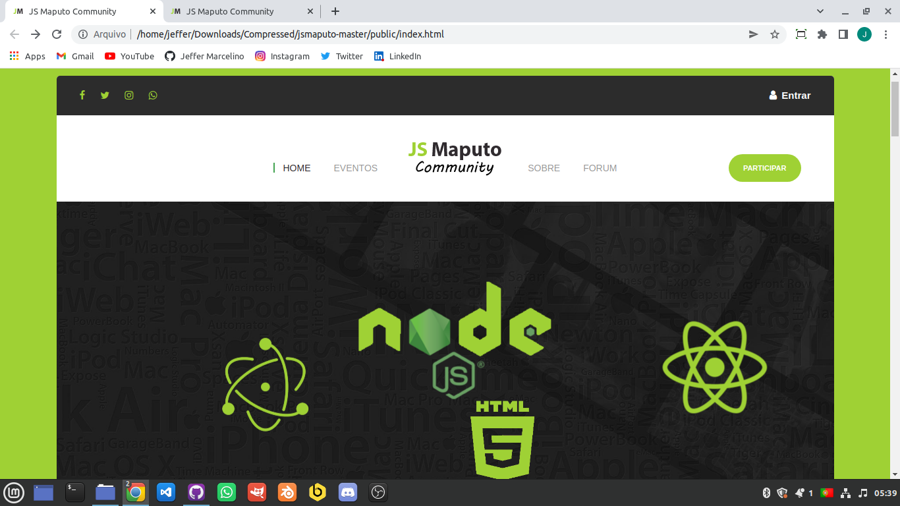
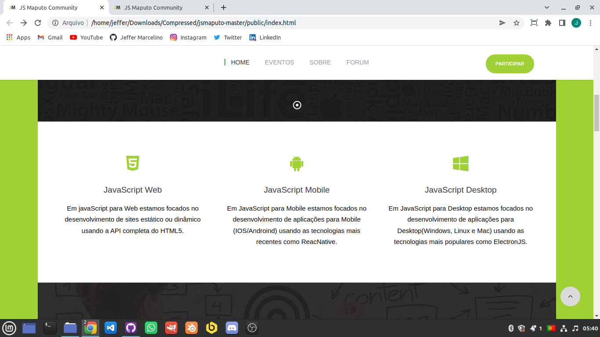
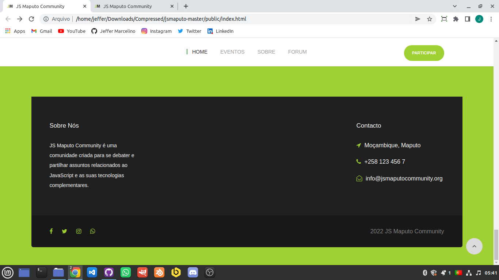

# JS Maputo
 

## 👀 Pré Visualizações

 

 

 

## 🚀 Tecnologias

Esse projeto foi desenvolvido com as seguintes tecnologias:

- HTML
- CSS
- JavaScript
- JQuery
- PHP

## 💻 Projeto

JS Maputo Community é uma comunidade criada para se debater e partilhar assuntos relacionados ao JavaScript e as suas tecnologias complementares.

## 🎯 Objectivo
### 🌏 Desenvolvimento Web

Em JavaScript para Web estamos focados no desenvolvimento de sites estático ou dinâmico usando a API completa do HTML5.

### 📱 Desenvolvimento Mobile

Em JavaScript para Mobile estamos focados no desenvolvimento de aplicações para Mobile (IOS/Androind) usando as tecnologias mais recentes como ReacNative.

### 🖱 Desenvolvimento Desktop

Em JavaScript para Desktop estamos focados no desenvolvimento de aplicações para Desktop(Windows, Linux e Mac) usando as tecnologias mais populares como ElectronJS.
